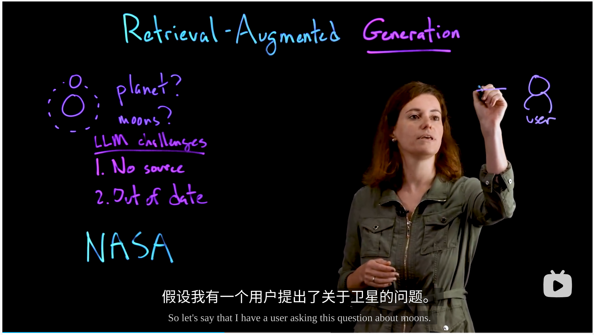
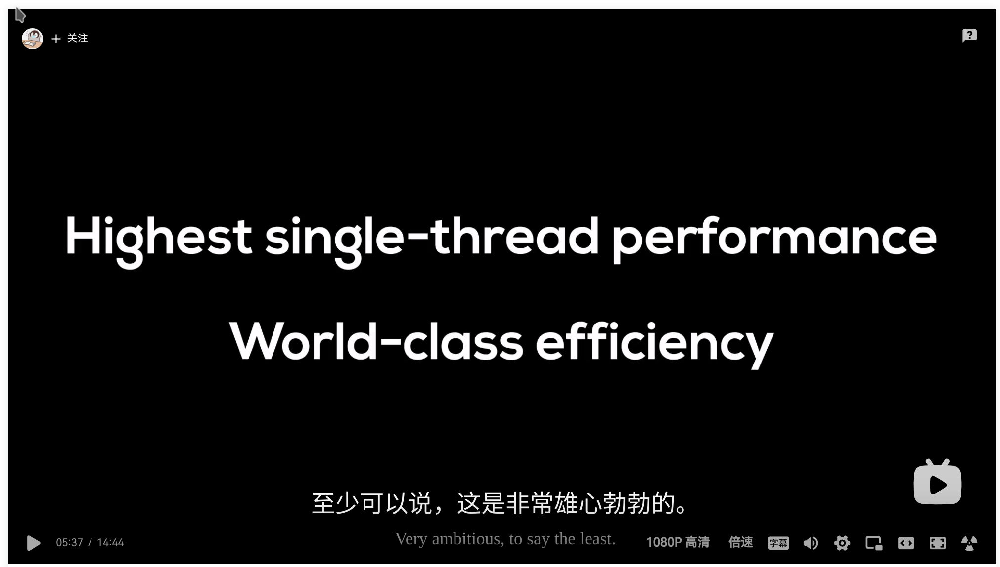
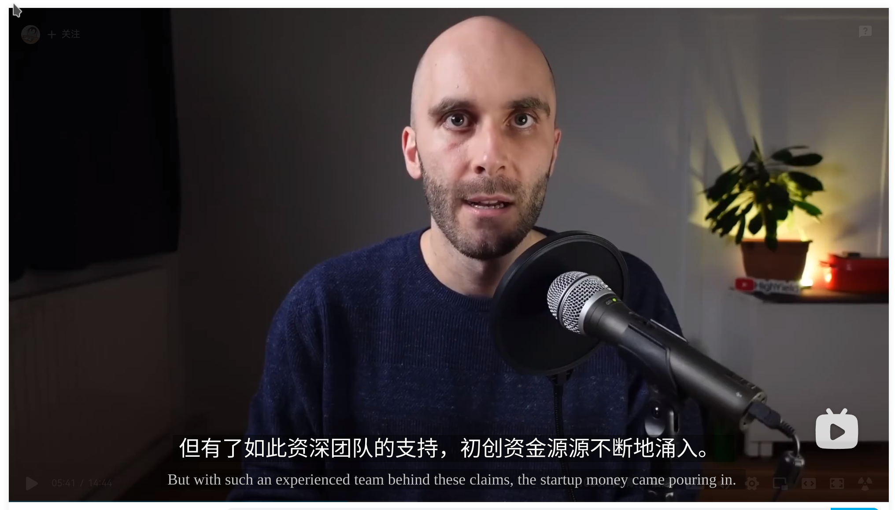
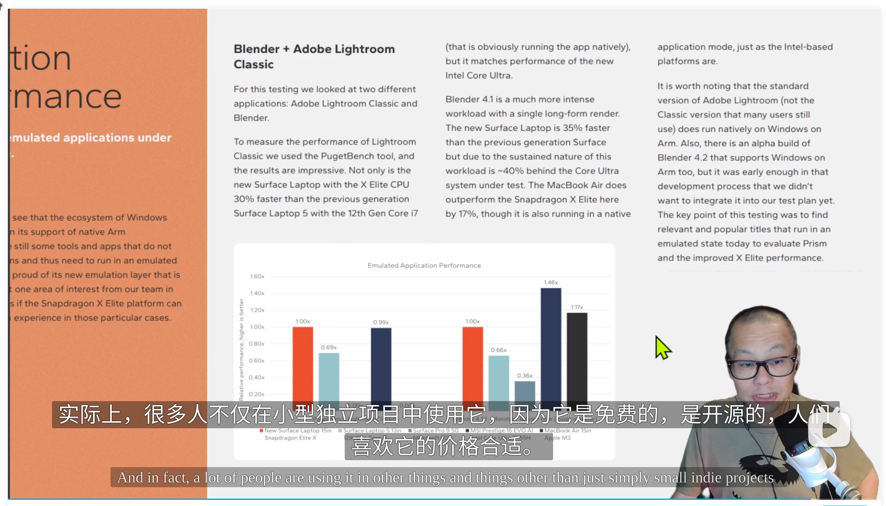

# whisperx_Sub

Whisperx_sub 是一个基于whisperx的视频听写和翻译的字幕生成工具

## 特点：

1. 凭借faster whisper语音模型,能够6-10x于原版whisper的速度生成英文字幕, 30分钟视频只需要1-3分钟就能生成完整的英文字幕。

2. whisperx的作者利用vad和wav2vec模型分别解决了whisper的幻听和单词停写不够准确的问题，改进后可以实现单词在逐秒尺度上的准确。

3. 通过总结英文断句规律和nltk等自然语言工具，实现了对较长英文句子的自动断句，可以在不影响翻译的情况下，达到对70%的长句的准确断句。

4. 使用常见的ollama本地大语言模型，能够实现生成英文字幕的高准确翻译，自动生成对应的中文字幕。
同时也开放了对远程大语言模型的支持，能够实现更快，更准确的批量翻译(batch translation), **强烈推荐使用**。

## 体验：

transcribe(听写)整个流程一般控制在两分钟以内, 30分钟以上的视频可能时间会更久。

翻译耗时：

批量翻译模式 约为视频时长的五分之一左右。
逐句翻译模式 约为视频时长的三分之一左右。
具体效果取决于模型自身。

### 效果：









> 部分无法分解的长句效果：




视频效果参考：

[什么是RAG 检索增强生成 【What_is_Retrieval_Augmented_Generation_RAG】](https://www.bilibili.com/video/BV1Kf421d7kj/?vd_source=fc60a3443b9b14ad9f2afef0ca8b093c)


## 配置需求：

一张能够运行CUDA的NVidia 显卡，具体配置需求参考whisper要求

2-10GB 显存的显卡应该都可以使用（2Gb以下的暂未测试过。

whisper模型共有5个大小，体积越大，transcribe精度越高，请根据你的显卡选择合适的模型。

|  Size  | Parameters | English-only model | Multilingual model | Required VRAM | Relative speed |
|:------:|:----------:|:------------------:|:------------------:|:-------------:|:--------------:|
|  tiny  |    39 M    |     `tiny.en`      |       `tiny`       |     ~1 GB     |      ~32x      |
|  base  |    74 M    |     `base.en`      |       `base`       |     ~1 GB     |      ~16x      |
| small  |   244 M    |     `small.en`     |      `small`       |     ~2 GB     |      ~6x       |
| medium |   769 M    |    `medium.en`     |      `medium`      |     ~5 GB     |      ~2x       |
| large  |   1550 M   |        N/A         |      `large`       |    ~10 GB     |       1x       |

默认使用的是对应的faster whisper large_v2模型。

#### 翻译：
项目提供了Ollama模型支持，翻译的准确度，速度依GPU性能 模型性能而定。

对于本地LLM模型，至少需要能够运行14B以上大小，否则完全无法保证翻译的质量。

本地模型建议使用单句翻译模型，批量翻译需要110b以上的模型。


> 作者推荐使用阿里的qwen 1.5 chat系列 模型，qwen 1.5 32b 量化模型在3090上表现良好，能够很好地实现单句准确翻译。


[qwen 1.5 chat](https://github.com/langchain-ai/langchain/assets/1011680/f0f0d0c9-f0f0-4f0f-8f0f-8f0f8f0f8f0f)

对于需要高准确度和批量翻译的用户，强烈建议使用大语言模型API，性能远超本地模型。


#### 注意

batch translation 需要大语言模型能够对自己的输出格式有严格的控制能力，**无法控制输出格式的模型尽量不要使用**

batch translation 速度是逐句翻译的3-5倍速度，且更加节省tokens。

> 作者推荐使用阿里的qwen plus模型，qwen plus实现了在翻译质量、api价格、翻译速度上的完美平衡。

[Qwen plus API](https://help.aliyun.com/zh/dashscope/developer-reference/model-introduction?spm=a2c4g.11186623.0.0.746b46c1FXZPd1)


## 使用方法

## Setup

首先根据requiremets.txt 安装依赖

### 1.craete a virtual environment with Python 3.10
`conda create -n whisperx_sub python==3.10`

`conda activate whisper`

### 2. Install Pytorch et al. for Linux or Windows CUDA11.8

`conda install pytorch==2.0.0 torchaudio==2.0.0 pytorch-cuda=11.8 -c pytorch -c nvidia`

*You need install Nvidia drivers for your GPU*

### 3. Install otherr dependency in requirements.txt


### 运行

运行前需要在config.py文件当中配置运行需要的相关信息

填入目标音频文件的路径，task类型，translation 使用的大语言模型相关的api信息。

## 输出结果

未经长句分割的字幕文件位于output文件夹下。
output/cut目录下是经过长句分割的字幕文件。

翻译得到的字幕文件为音频文件名字 +CN-ZH.srt文件。

```bash
git clone xxxx
cd  whisperx_Sub

pip install -r requirements.txt
```


## Todo 

- 更多的语言支持，目前只支持英文（作者只会英语
- 更强的长句断句能力，目前通过手工分析只能解决70%的断句问题
- 图形化界面，需要一个GUI来降低使用门槛，方便广大用户
- 修复 whisperx自身的一些错误，提高transcribe的质量


## 更新日志
